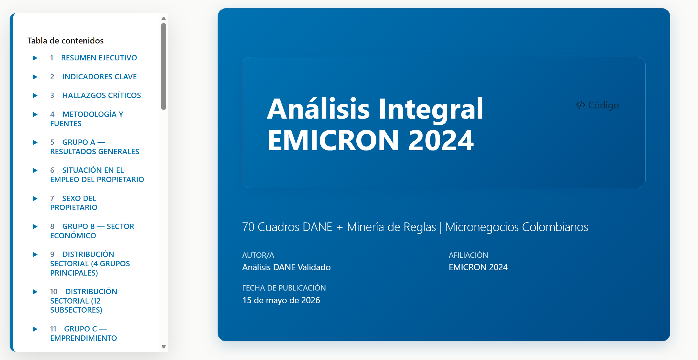
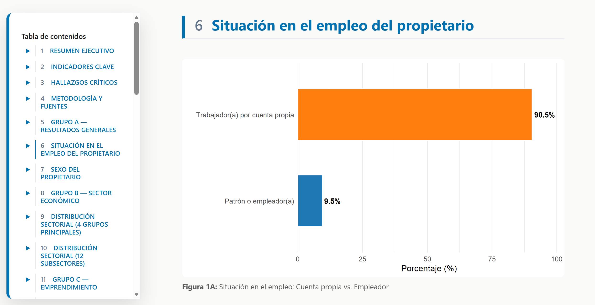
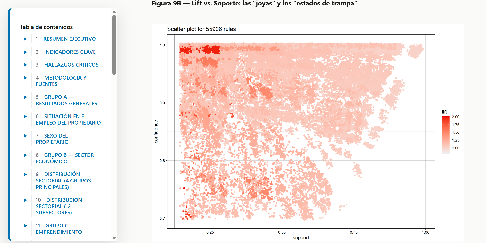

# EMICRON 2024 — Análisis Integral de Micronegocios Colombianos

[](https://www.r-project.org/)
[](https://quarto.org/)
[](LICENSE)
[](https://dmetrics1.github.io/micronegocios-colombia-2024/)

**Minería de patrones sobre 5,3M micronegocios colombianos (EMICRON 2024, DANE) · 85 cuadros oficiales · reporte interactivo en R + Quarto.**

> **📊 Reporte en vivo →** [dmetrics1.github.io/micronegocios-colombia-2024](https://dmetrics1.github.io/micronegocios-colombia-2024/)
> **🎓 Investigación →** versión académica postulada a **[LatinR 2026](https://latin-r.com/)** — *Economía Popular en Colombia* (ver [`paper/`](paper/)).

---

## 📸 Capturas del reporte

<table>
  <tr>
    <td width="50%"></td>
    <td width="50%"></td>
  </tr>
  <tr>
    <td colspan="2"></td>
  </tr>
</table>

---

## 🔑 Hallazgos clave

El microempresariado colombiano se sostiene sobre **tres fracturas estructurales que se refuerzan entre sí** — informalidad fiscal, exclusión digital y restricción crediticia — formando un *sistema de trampas interdependientes*:

| Indicador | Valor | Lectura |
|---|---|---|
| 🏛️ **Informalidad fiscal** | **77,6%** sin RUT | +4M de unidades fuera del radar tributario |
| 📵 **Brecha digital** | **50,4%** sin internet | Polarización tecnológica en punto crítico |
| 💳 **Acceso crediticio** | **14,2%** solicitó crédito | Financiamiento formal casi inexistente |
| 👤 **Autoempleo** | **90,5%** por cuenta propia | Baja generación de empleo asalariado (9,5% patrones) |
| ♀️ **Brecha de género** | **35,4%** lideradas por mujeres | 64,6% en manos de hombres |

**🔗 Patrón Apriori más fuerte** (de 55.906 reglas → 39 de alta relevancia, soporte ≥15% y confianza ≥70%):

> `{Sin dispositivos, sin celular de negocio, sin transferencias} → {Sin internet}`
> **Confianza 99,6% · Soporte 26,6%** — ~1,4M de negocios operan en un entorno **totalmente analógico** donde la falta de una herramienta bloquea el acceso a internet y pagos digitales.

📄 *Síntesis completa en [`docs/informe_caracterizacion_y_reglas.md`](docs/informe_caracterizacion_y_reglas.md) · reporte interactivo en [vivo](https://dmetrics1.github.io/micronegocios-colombia-2024/).*

---

## 🎯 Qué hace este proyecto

Pipeline reproducible en **R** que toma los microdatos crudos del DANE y produce evidencia lista para decisión:

✅ Réplica validada de **85 cuadros oficiales DANE** · ✅ **EDA** ponderado · ✅ **minería de reglas (Apriori)** · ✅ **reporte interactivo** en Quarto + CSS Grid

## 📊 Datos

| | |
|---|---|
| **Universo** | 5.297.252 micronegocios (Colombia) |
| **Muestra** | 77.202 negocios encuestados · 11 módulos |
| **Período** | 2024 · factor de expansión ponderado |
| **Salida** | 85 cuadros (70 validados contra el boletín DANE) + 39 reglas de asociación |
| **Fuente** | [Encuesta de Micronegocios (EMICRON) — DANE](https://www.dane.gov.co/) |

## 🔍 Pipeline

```
Data DANE (11 CSV)
   → [01] Consolidar → [02] Limpiar + feature engineering
   → [03] 85 cuadros ponderados  →  output/tablas/boletin/*.csv
   → [04] EDA + gráficos  →  [05] Apriori (reglas de asociación)
   → REPORTE_WIDE_PRO_2024.qmd  →  reporte HTML interactivo
```

## 🚀 Reproducir

```r
# 1. Dependencias (R 4.0+)
install.packages(c("tidyverse", "haven", "arules", "arulesViz", "data.table"))

# 2. Abre emicron.Rproj en RStudio y ejecuta el pipeline completo:
source("main.R")
```

```bash
# 3. Genera el reporte (desde la raíz, donde viven el .qmd y el .scss):
quarto render REPORTE_WIDE_PRO_2024.qmd --to html
```

> Los microdatos crudos del DANE **no se versionan** (tamaño + licencia). Descárgalos de [microdatos.dane.gov.co](https://microdatos.dane.gov.co) y colócalos en `data/raw/2024/`.

## 🛠️ Stack

**R 4.0+** · `tidyverse` · `data.table` · `arules` / `arulesViz` (minería) · **Quarto** + `ggplot2` (reportería) · SCSS / CSS Grid

---

<details>
<summary><b>📁 Estructura del proyecto</b></summary>

```
emicron/
├── README.md · LICENSE · index.html        # Doc, licencia, redirect a Pages
├── REPORTE_WIDE_PRO_2024.qmd / .html        # Reporte interactivo (fuente + compilado)
├── custom-wide-pro.scss                     # Estilos premium del reporte
├── main.R                                   # Pipeline completo de ejecución
├── EJECUTAR_EDA_APRIORI_AHORA.R             # Atajo: solo EDA + Apriori
├── ANALISIS_REGLAS_SOPORTE_24.R             # Análisis de reglas (soporte ≥ 24%)
├── emicron.Rproj
│
├── data/        raw/2024/ (11 CSV DANE) · processed/ (RDS consolidados)
├── scripts/     00_config → 01_consolidar → 02_limpiar → 03_cuadros → 04_eda → 04b_graficos → 05_apriori
├── output/      tablas/boletin/ (85 CSV) · figuras/ · informes/
├── paper/       Resumen + plantilla LatinR 2026
└── docs/        Diccionario, Protocolo, informe de hallazgos y catálogo de cuadros
```

</details>

<details>
<summary><b>📚 Documentación completa</b></summary>

| Documento | Propósito |
|---|---|
| [`docs/informe_caracterizacion_y_reglas.md`](docs/informe_caracterizacion_y_reglas.md) | Síntesis ejecutiva de hallazgos descriptivos y patrones Apriori |
| [`docs/PROTOCOLO_MAESTRO_EMICRON.md`](docs/PROTOCOLO_MAESTRO_EMICRON.md) | Metodologías oficiales de procesamiento ponderado del DANE |
| [`docs/Diccionario_EMICRON_2024.md`](docs/Diccionario_EMICRON_2024.md) | Diccionario de variables y variables derivadas |
| [`docs/CUADROS_NUEVOS_AGREGADOS.md`](docs/CUADROS_NUEVOS_AGREGADOS.md) | Catálogo de los 85 cuadros y cobertura DANE |
| [`paper/`](paper/) | Resumen académico postulado a LatinR 2026 |

</details>

---

## 📄 Licencia · 🙏 Créditos

Distribuido bajo licencia **MIT** — úsalo libremente con atribución (ver [`LICENSE`](LICENSE)).
**Datos:** DANE — EMICRON 2024 · **Métodos:** EDA ponderado + Apriori (`arules`) · **Reportería:** Quarto + R.

---

## 👤 Autor

**Daniel Molina Barrios** — Economista & Data Scientist · Santa Marta, Colombia

> *"Transformo datos en soluciones, productos y decisiones."*

[](https://github.com/dmetrics1)
[](https://www.linkedin.com/in/daniel-molina-b76a4323b/)
[](mailto:dm0025900@gmail.com)
